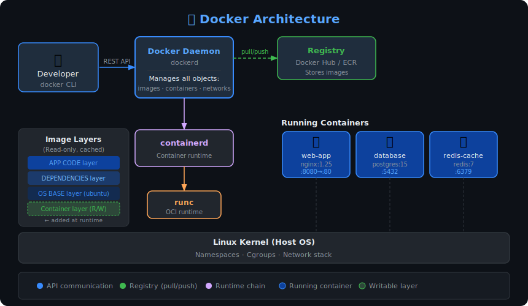

# 🐳 Docker — Complete Notes




> Docker is a platform that lets you package your application and everything it needs (code, libraries, config) into a single unit called a **container**, so it runs the same way on any machine.

---

## 1. Why Docker? The Problem It Solves

Imagine you build an app on your laptop using Python 3.10. It works perfectly. Then it goes to the server running Python 3.7 — it breaks. Your team member has a different OS — it breaks again.

This is the classic **"it works on my machine"** problem.

Docker solves this by packaging the app with its entire environment. The container carries Python 3.10, your libraries, your config — all of it. Wherever Docker runs, your app runs exactly the same.

---

## 2. Key Concepts

### 2.1 Image

A Docker **image** is a read-only template — like a blueprint or a recipe. It defines what goes inside the container: the OS base, installed software, environment variables, copied files, and the startup command.

Images are built from a file called a `Dockerfile`. You can think of an image like a class in programming — it doesn't run by itself, but you create instances (containers) from it.

```
Image = Blueprint (static, stored)
Container = Running instance of that image (dynamic, alive)
```

### 2.2 Container

A **container** is a running instance of an image. It's isolated from the host OS but shares the host's kernel, which makes it much lighter than a full virtual machine.

You can run 10 containers from the same image, each doing different things. Stop a container — it pauses. Delete it — the image still exists, so you can create a fresh one anytime.

### 2.3 Registry

A **registry** is where images are stored and shared. Docker Hub (`hub.docker.com`) is the default public registry. You can also set up a private registry for your team using AWS ECR, GitHub Container Registry, or a self-hosted registry.

When you run `docker pull nginx`, Docker fetches the `nginx` image from Docker Hub.

### 2.4 Docker Daemon

The **Docker Daemon** (`dockerd`) is the background service that does the actual work — building images, running containers, managing volumes and networks. When you type any `docker` command, the Docker CLI sends that instruction to the daemon.

---

## 3. Docker Architecture

```
You (CLI)  →  Docker Daemon  →  Container Runtime (containerd)
                    ↓
             Images, Containers, Networks, Volumes
```

The daemon talks to **containerd** (the actual runtime that starts/stops containers) and **runc** (which creates the isolated Linux namespaces). As a user, you don't interact with these directly — the daemon handles it all.

---

## 4. Dockerfile — Writing Your First One

A `Dockerfile` is a plain text file with step-by-step instructions. Each instruction creates a new **layer** on top of the previous one.

```dockerfile
# Start from an official Python base image
FROM python:3.11-slim

# Set the working directory inside the container
WORKDIR /app

# Copy only requirements first (smart caching trick)
COPY requirements.txt .

# Install dependencies
RUN pip install --no-cache-dir -r requirements.txt

# Copy the rest of your application code
COPY . .

# Tell Docker which port your app listens on (documentation only)
EXPOSE 8000

# The command to run when the container starts
CMD ["python", "app.py"]
```

### Why copy `requirements.txt` before copying the full code?

Docker builds images in layers and **caches** each layer. If you copy everything first and then install dependencies, any code change (even a typo fix) will bust the cache and re-run `pip install`. By copying `requirements.txt` alone first, Docker only re-installs packages if that file actually changed — saving significant build time.

### Key Dockerfile Instructions

| Instruction | What it does |
|-------------|-------------|
| `FROM` | Base image to start from (always first) |
| `WORKDIR` | Sets the working directory for commands below |
| `COPY` | Copies files from your machine into the image |
| `ADD` | Like COPY but also extracts tarballs and supports URLs |
| `RUN` | Runs a command during the image build |
| `CMD` | Default command when container starts (can be overridden) |
| `ENTRYPOINT` | Like CMD but harder to override — use for the main process |
| `ENV` | Sets environment variables |
| `ARG` | Build-time variable (not available at runtime) |
| `EXPOSE` | Documents the port (doesn't actually publish it) |
| `VOLUME` | Creates a mount point for persistent data |

---

## 5. Essential Docker Commands

### Images

```bash
# Build an image from Dockerfile in current directory
docker build -t myapp:1.0 .

# List all images on your machine
docker images

# Pull an image from Docker Hub
docker pull nginx:latest

# Remove an image
docker rmi myapp:1.0

# Remove all unused images (cleanup)
docker image prune -a
```

### Containers

```bash
# Run a container (pulls image if not found locally)
docker run nginx

# Run in background (detached mode)
docker run -d nginx

# Run with a name you choose
docker run -d --name my-nginx nginx

# Map host port 8080 to container port 80
docker run -d -p 8080:80 nginx

# Run and drop into a bash shell
docker run -it ubuntu bash

# List running containers
docker ps

# List all containers (including stopped)
docker ps -a

# Stop a container gracefully
docker stop my-nginx

# Remove a stopped container
docker rm my-nginx

# View logs of a container
docker logs my-nginx

# Follow logs in real time
docker logs -f my-nginx

# Execute a command inside a running container
docker exec -it my-nginx bash

# Inspect detailed info about a container
docker inspect my-nginx
```

---

## 6. Volumes — Persistent Data

By default, when a container is deleted, all its data is gone. **Volumes** solve this — they store data outside the container's lifecycle.

### Types of storage in Docker

**Named Volumes** — managed by Docker, stored in Docker's data directory. Best for databases and app data.

```bash
# Create a volume
docker volume create mydata

# Use it when running a container
docker run -d -v mydata:/var/lib/mysql mysql

# List volumes
docker volume ls
```

**Bind Mounts** — you point to a specific path on your host machine. Great for development — your code changes reflect instantly in the container.

```bash
# Mount current directory into the container
docker run -d -v $(pwd):/app myapp
```

**tmpfs Mounts** — data stored in memory only, never written to disk. Useful for sensitive data like secrets during runtime.

---

## 7. Networking in Docker

Containers are isolated by default — they can't talk to each other unless you connect them through a network.

### Network drivers

**Bridge (default)** — containers on the same bridge network can talk to each other by container name. Host-to-container access requires port mapping (`-p`).

```bash
# Create a custom bridge network
docker network create mynet

# Run containers on the same network
docker run -d --network mynet --name app myapp
docker run -d --network mynet --name db postgres

# Now 'app' can reach 'db' using the hostname 'db'
```

**Host** — removes network isolation. Container uses the host's network directly. No port mapping needed, but less secure.

**None** — completely isolates the container from all networking.

**Overlay** — used in Docker Swarm to connect containers across multiple hosts.

---

## 8. Docker Compose — Multi-Container Apps

Running multiple containers with individual `docker run` commands gets messy. **Docker Compose** lets you define your entire multi-container application in a single YAML file.

```yaml
# docker-compose.yml
version: '3.9'

services:
  web:
    build: .              # Build from Dockerfile in current dir
    ports:
      - "8000:8000"
    environment:
      - DATABASE_URL=postgresql://user:pass@db:5432/mydb
    depends_on:
      - db               # Start db first
    volumes:
      - .:/app           # Bind mount for live code changes

  db:
    image: postgres:15
    environment:
      POSTGRES_USER: user
      POSTGRES_PASSWORD: pass
      POSTGRES_DB: mydb
    volumes:
      - pgdata:/var/lib/postgresql/data  # Persist database files

volumes:
  pgdata:   # Named volume definition
```

```bash
# Start everything in background
docker compose up -d

# Stop everything
docker compose down

# Stop and delete volumes too
docker compose down -v

# View logs from all services
docker compose logs -f

# Rebuild images and restart
docker compose up -d --build
```

---

## 9. Multi-Stage Builds — Smaller, Safer Images

A common problem: your build tools (compilers, test runners, SDK) bloat the final image. Multi-stage builds let you use one stage to build and a smaller stage to ship.

```dockerfile
# ---- Stage 1: Build ----
FROM node:20 AS builder
WORKDIR /app
COPY package*.json ./
RUN npm ci
COPY . .
RUN npm run build      # Produces /app/dist

# ---- Stage 2: Production ----
FROM node:20-alpine    # Much smaller base
WORKDIR /app
COPY --from=builder /app/dist ./dist   # Only copy what we need
COPY package*.json ./
RUN npm ci --only=production
CMD ["node", "dist/index.js"]
```

The final image only contains the `dist` output and production packages — no dev dependencies, no source code, no build tools. This dramatically reduces image size and attack surface.

---

## 10. Docker Best Practices

**Use specific image tags** — never use `latest` in production. `nginx:latest` today might be a different version tomorrow. Pin versions like `nginx:1.25.3`.

**Run as non-root** — by default containers run as root, which is a security risk. Add a user:

```dockerfile
RUN addgroup --system appgroup && adduser --system --ingroup appgroup appuser
USER appuser
```

**Keep images small** — use `alpine` or `slim` variants. Remove unnecessary files in the same `RUN` layer that creates them:

```dockerfile
RUN apt-get update && apt-get install -y curl \
    && rm -rf /var/lib/apt/lists/*
```

**Use `.dockerignore`** — like `.gitignore` but for Docker. Prevents unnecessary files from being sent to the daemon during build:

```
node_modules
.git
*.log
.env
__pycache__
```

**One process per container** — containers work best when they do one thing. Don't run your web server and database in the same container.

---

## 11. Docker vs Virtual Machines

| | Docker Container | Virtual Machine |
|-|-----------------|-----------------|
| Startup time | Seconds | Minutes |
| Size | Megabytes | Gigabytes |
| OS | Shares host kernel | Full OS per VM |
| Isolation | Process-level | Hardware-level |
| Performance | Near native | Some overhead |
| Use case | Apps, microservices | Full OS isolation |

VMs virtualize hardware. Containers virtualize the OS. That's why containers are faster and lighter — they skip the full OS boot and share the host kernel.

---

## 12. Quick Reference Cheatsheet

```bash
# Build
docker build -t name:tag .

# Run
docker run -d -p hostPort:containerPort --name name image

# Shell into running container
docker exec -it containerName bash

# Logs
docker logs -f containerName

# Compose up/down
docker compose up -d
docker compose down

# Cleanup everything unused
docker system prune -a
```

---

*Source: Docker official documentation — https://docs.docker.com/manuals/*
