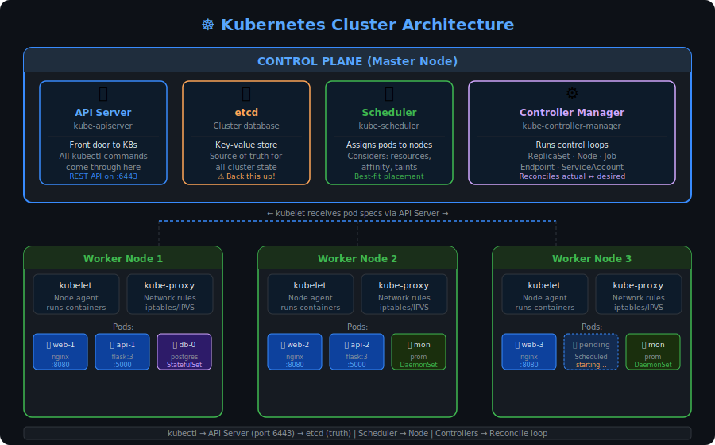

# ☸️ Kubernetes (K8s) — Complete Notes




> Kubernetes is an open-source system for automating the deployment, scaling, and management of containerized applications. If Docker is about packaging apps into containers, Kubernetes is about running thousands of those containers reliably at scale.

---

## 1. Why Kubernetes? The Problem It Solves

Docker is great for running containers on a single machine. But in production, you need answers to these questions:

- What happens when a container crashes? Who restarts it?
- How do you run 10 copies of your app across 5 servers and balance traffic between them?
- How do you update your app without downtime?
- How do you scale up during peak hours and scale down to save money at night?

Kubernetes answers all of these. It treats your servers as a pool of resources and decides where and how to run your containers, constantly watching and healing the system when things go wrong.

The name "Kubernetes" comes from Greek, meaning "helmsman" or "pilot." The abbreviation **K8s** comes from the 8 letters between K and s.

---

## 2. Kubernetes Architecture

A Kubernetes cluster is made up of two types of machines: the **Control Plane** (the brain) and **Worker Nodes** (the muscle).

```
┌─────────────────────────────────────────────────────┐
│                   CONTROL PLANE                      │
│                                                      │
│  API Server  →  etcd (database)                     │
│      ↕                                              │
│  Scheduler   →  Controller Manager                  │
└─────────────────────────────────────────────────────┘
           ↕ communicates via API Server
┌──────────────┐   ┌──────────────┐   ┌──────────────┐
│  Worker Node  │   │  Worker Node  │   │  Worker Node  │
│   kubelet    │   │   kubelet    │   │   kubelet    │
│   kube-proxy │   │   kube-proxy │   │   kube-proxy │
│  [ Pods ]    │   │  [ Pods ]    │   │  [ Pods ]    │
└──────────────┘   └──────────────┘   └──────────────┘
```

### Control Plane Components

**API Server (`kube-apiserver`)** — the front door to Kubernetes. Every `kubectl` command, every internal component communicates through here. It validates and processes requests, then updates the state in etcd.

**etcd** — a distributed key-value store that is the single source of truth for all cluster data. Every object you create (pods, services, deployments) is stored here as JSON. It's highly consistent and uses the Raft consensus algorithm. **Back this up — losing etcd means losing your entire cluster state.**

**Scheduler (`kube-scheduler`)** — watches for newly created pods that have no Node assigned and picks the best Node for them. It considers resource availability, affinity rules, taints, and tolerations when deciding placement.

**Controller Manager (`kube-controller-manager`)** — runs a collection of controllers in a single process. The **ReplicaSet controller** ensures the right number of pod copies are running. The **Node controller** handles node failures. The **Job controller** manages batch tasks. Each controller constantly watches the actual state and tries to match it to the desired state.

**Cloud Controller Manager** — when running on a cloud provider (AWS, GCP, Azure), this component handles cloud-specific logic like provisioning load balancers, attaching cloud volumes, and managing cloud node lifecycles.

### Worker Node Components

**kubelet** — the agent that runs on every worker node. It receives pod specs from the API server and ensures the described containers are running and healthy. If a container dies, kubelet restarts it.

**kube-proxy** — handles network rules on the node. It maintains iptables or IPVS rules that allow traffic to reach the right pods, implementing the Service abstraction.

**Container Runtime** — the software that actually runs containers. Kubernetes supports containerd (default), CRI-O, and others. Docker Engine is no longer directly supported as a runtime since Kubernetes 1.24.

---

## 3. Kubernetes Objects — The Building Blocks

Everything in Kubernetes is an **object** — a persistent record of your desired state. You create objects by writing YAML and applying it to the cluster. Kubernetes then works to make reality match what you described.

Every object has:
- `apiVersion` — which API version to use
- `kind` — what type of object
- `metadata` — name, namespace, labels
- `spec` — what you want (the desired state)

### 3.1 Pod

A **Pod** is the smallest deployable unit in Kubernetes. It wraps one or more containers that share the same network namespace and storage. Containers inside a pod can talk to each other via `localhost`.

```yaml
apiVersion: v1
kind: Pod
metadata:
  name: my-app
  labels:
    app: my-app
spec:
  containers:
    - name: app-container
      image: nginx:1.25
      ports:
        - containerPort: 80
      resources:
        requests:
          memory: "64Mi"     # Minimum guaranteed
          cpu: "250m"        # 250 millicores = 0.25 CPU
        limits:
          memory: "128Mi"    # Maximum allowed
          cpu: "500m"
```

**You almost never create Pods directly.** If a Pod crashes, it's gone — nothing recreates it. Instead you use higher-level objects (Deployments) that manage Pods for you.

### 3.2 Deployment

A **Deployment** describes your desired state for a set of pods. It creates a **ReplicaSet** which in turn creates and manages the actual pods. This is what you use for stateless applications.

```yaml
apiVersion: apps/v1
kind: Deployment
metadata:
  name: web-app
  namespace: production
spec:
  replicas: 3                  # Run 3 copies at all times
  selector:
    matchLabels:
      app: web-app             # Manages pods with this label
  strategy:
    type: RollingUpdate
    rollingUpdate:
      maxSurge: 1              # Allow 1 extra pod during update
      maxUnavailable: 0        # Never go below 3 healthy pods
  template:                   # Pod template
    metadata:
      labels:
        app: web-app
    spec:
      containers:
        - name: web
          image: myapp:2.1
          ports:
            - containerPort: 8080
          readinessProbe:       # Is the app ready to serve traffic?
            httpGet:
              path: /health
              port: 8080
            initialDelaySeconds: 10
            periodSeconds: 5
          livenessProbe:        # Is the app still alive?
            httpGet:
              path: /health
              port: 8080
            initialDelaySeconds: 30
            periodSeconds: 10
```

**RollingUpdate strategy** ensures zero-downtime deployments. Kubernetes brings up new pods first, then terminates old ones — traffic never fully drops.

### 3.3 Service

Pods are temporary — they get new IP addresses every time they restart. A **Service** gives you a stable network endpoint. It load-balances traffic across all matching pods using label selectors.

```yaml
apiVersion: v1
kind: Service
metadata:
  name: web-service
spec:
  selector:
    app: web-app       # Routes to all pods with this label
  ports:
    - port: 80         # Port the Service listens on
      targetPort: 8080 # Port on the pod
  type: ClusterIP      # Default — only accessible within the cluster
```

**Service types:**

| Type | Accessible from | Use case |
|------|----------------|----------|
| `ClusterIP` | Inside cluster only | Internal microservice communication |
| `NodePort` | Outside cluster via `NodeIP:Port` | Dev/testing, direct access |
| `LoadBalancer` | Public internet via cloud LB | Production external traffic |
| `ExternalName` | Maps to external DNS name | Integrating external services |

### 3.4 Ingress

A **Service of type LoadBalancer** creates one cloud load balancer per service — expensive at scale. **Ingress** is a smarter solution: one load balancer that routes traffic to multiple services based on host name or URL path.

```yaml
apiVersion: networking.k8s.io/v1
kind: Ingress
metadata:
  name: main-ingress
  annotations:
    nginx.ingress.kubernetes.io/rewrite-target: /
spec:
  rules:
    - host: myapp.example.com
      http:
        paths:
          - path: /api
            pathType: Prefix
            backend:
              service:
                name: api-service
                port:
                  number: 80
          - path: /
            pathType: Prefix
            backend:
              service:
                name: frontend-service
                port:
                  number: 80
```

Ingress requires an **Ingress Controller** to be installed (NGINX Ingress Controller is most common). The controller is the actual component that reads Ingress rules and configures the reverse proxy.

### 3.5 ConfigMap and Secret

**ConfigMap** stores non-sensitive configuration data as key-value pairs and injects it into pods as environment variables or mounted files — without hardcoding config into the image.

```yaml
apiVersion: v1
kind: ConfigMap
metadata:
  name: app-config
data:
  LOG_LEVEL: "info"
  MAX_CONNECTIONS: "100"
  config.yaml: |
    server:
      port: 8080
      timeout: 30s
```

**Secret** stores sensitive data (passwords, tokens, certificates). The data is base64-encoded (not encrypted by default — enable encryption at rest in production).

```yaml
apiVersion: v1
kind: Secret
metadata:
  name: db-secret
type: Opaque
data:
  username: dXNlcg==      # base64 of "user"
  password: cGFzc3dvcmQ=  # base64 of "password"
```

Using them in a pod:

```yaml
spec:
  containers:
    - name: app
      image: myapp
      env:
        - name: LOG_LEVEL
          valueFrom:
            configMapKeyRef:
              name: app-config
              key: LOG_LEVEL
        - name: DB_PASSWORD
          valueFrom:
            secretKeyRef:
              name: db-secret
              key: password
      volumeMounts:
        - name: config-vol
          mountPath: /etc/config
  volumes:
    - name: config-vol
      configMap:
        name: app-config
```

### 3.6 Namespace

Namespaces are virtual clusters within a cluster — a way to divide cluster resources between teams or environments.

```bash
# Create a namespace
kubectl create namespace staging

# Deploy into a specific namespace
kubectl apply -f deployment.yaml -n staging

# View resources in a namespace
kubectl get pods -n staging

# View resources across all namespaces
kubectl get pods --all-namespaces
```

Default namespaces: `default`, `kube-system` (core components), `kube-public`, `kube-node-lease`.

---

## 4. Scaling

### Manual Scaling

```bash
kubectl scale deployment web-app --replicas=5
```

### Horizontal Pod Autoscaler (HPA)

HPA automatically scales the number of pods based on CPU or memory usage (or custom metrics).

```yaml
apiVersion: autoscaling/v2
kind: HorizontalPodAutoscaler
metadata:
  name: web-app-hpa
spec:
  scaleTargetRef:
    apiVersion: apps/v1
    kind: Deployment
    name: web-app
  minReplicas: 2
  maxReplicas: 10
  metrics:
    - type: Resource
      resource:
        name: cpu
        target:
          type: Utilization
          averageUtilization: 70   # Scale up if CPU > 70%
```

When CPU usage across pods exceeds 70%, HPA adds more pods. When load drops, it scales back down — saving resources.

---

## 5. Storage in Kubernetes

### PersistentVolume (PV) and PersistentVolumeClaim (PVC)

A **PersistentVolume** is a piece of storage provisioned in the cluster (by an admin or automatically). A **PersistentVolumeClaim** is a request for storage by a pod — like ordering storage without caring about the exact hardware.

```yaml
# PVC — what the pod requests
apiVersion: v1
kind: PersistentVolumeClaim
metadata:
  name: database-storage
spec:
  accessModes:
    - ReadWriteOnce         # One node can mount read-write
  storageClassName: gp2    # AWS GP2 SSD storage class
  resources:
    requests:
      storage: 10Gi
```

```yaml
# Pod using the PVC
volumes:
  - name: db-vol
    persistentVolumeClaim:
      claimName: database-storage
```

**StorageClass** enables dynamic provisioning — when a PVC is created, the StorageClass automatically provisions the actual storage from the cloud provider (AWS EBS, GCP Persistent Disk, etc.).

---

## 6. StatefulSet — For Stateful Apps

Deployments treat pods as interchangeable — any pod can go anywhere. **StatefulSets** are for applications that need stable identities and ordered deployment, like databases.

Each pod in a StatefulSet gets:
- A stable, predictable name: `mysql-0`, `mysql-1`, `mysql-2`
- Its own PersistentVolumeClaim that follows it
- Ordered, graceful startup and shutdown

```yaml
apiVersion: apps/v1
kind: StatefulSet
metadata:
  name: mysql
spec:
  serviceName: "mysql"
  replicas: 3
  selector:
    matchLabels:
      app: mysql
  template:
    metadata:
      labels:
        app: mysql
    spec:
      containers:
        - name: mysql
          image: mysql:8.0
          env:
            - name: MYSQL_ROOT_PASSWORD
              valueFrom:
                secretKeyRef:
                  name: mysql-secret
                  key: password
  volumeClaimTemplates:         # Each pod gets its own volume
    - metadata:
        name: data
      spec:
        accessModes: ["ReadWriteOnce"]
        resources:
          requests:
            storage: 20Gi
```

---

## 7. RBAC — Role-Based Access Control

RBAC controls who can do what in the cluster. Instead of giving everyone admin access, you define fine-grained permissions.

```yaml
# Role — what actions are allowed on which resources
apiVersion: rbac.authorization.k8s.io/v1
kind: Role
metadata:
  name: pod-reader
  namespace: production
rules:
  - apiGroups: [""]
    resources: ["pods", "pods/logs"]
    verbs: ["get", "list", "watch"]   # Read-only on pods

---
# RoleBinding — who gets this Role
apiVersion: rbac.authorization.k8s.io/v1
kind: RoleBinding
metadata:
  name: read-pods
  namespace: production
subjects:
  - kind: User
    name: developer@company.com
    apiGroup: rbac.authorization.k8s.io
roleRef:
  kind: Role
  name: pod-reader
  apiGroup: rbac.authorization.k8s.io
```

Use `ClusterRole` and `ClusterRoleBinding` for permissions that apply across all namespaces.

---

## 8. Essential kubectl Commands

```bash
# ── Cluster Info ────────────────────────────────────────
kubectl cluster-info
kubectl get nodes
kubectl describe node <node-name>

# ── Pods ────────────────────────────────────────────────
kubectl get pods
kubectl get pods -o wide          # Shows which node each pod is on
kubectl describe pod <pod-name>   # Detailed info + events (great for debugging)
kubectl logs <pod-name>
kubectl logs -f <pod-name>        # Follow live logs
kubectl exec -it <pod-name> -- bash  # Shell into a pod

# ── Deployments ─────────────────────────────────────────
kubectl apply -f deployment.yaml
kubectl get deployments
kubectl rollout status deployment/web-app
kubectl rollout history deployment/web-app
kubectl rollout undo deployment/web-app   # Rollback!
kubectl set image deployment/web-app app=myapp:2.2  # Update image

# ── Services ────────────────────────────────────────────
kubectl get services
kubectl port-forward service/web-service 8080:80  # Local access to a service

# ── General ─────────────────────────────────────────────
kubectl apply -f .               # Apply all YAML files in directory
kubectl delete -f deployment.yaml
kubectl get all -n namespace     # Everything in a namespace
kubectl top pods                 # CPU/Memory usage (requires metrics-server)
```

---

## 9. Probes — Health Checks

Kubernetes uses probes to know if a container is healthy.

**Liveness Probe** — "Is this container still alive?" If it fails, Kubernetes kills and restarts the container.

**Readiness Probe** — "Is this container ready to serve traffic?" If it fails, Kubernetes removes it from Service endpoints until it recovers.

**Startup Probe** — "Has the app finished starting?" Gives slow-starting apps extra time before liveness kicks in.

```yaml
livenessProbe:
  httpGet:
    path: /healthz
    port: 8080
  initialDelaySeconds: 30    # Wait 30s before first check
  periodSeconds: 10          # Check every 10s
  failureThreshold: 3        # Restart after 3 failures

readinessProbe:
  httpGet:
    path: /ready
    port: 8080
  initialDelaySeconds: 5
  periodSeconds: 5
```

---

## 10. Kubernetes vs Docker Compose

| Feature | Docker Compose | Kubernetes |
|---------|---------------|------------|
| Scale | Single host | Multiple hosts |
| Self-healing | No | Yes |
| Rolling updates | Basic | Built-in |
| Load balancing | Basic | Advanced |
| Auto-scaling | No | HPA/VPA |
| Use case | Dev / small apps | Production / enterprise |

Docker Compose is perfect for local development. Kubernetes is production-grade orchestration.

---

*Source: Kubernetes official documentation — https://kubernetes.io/docs/concepts/*
